--- 
title: "Fields"
author: "Claire Greenland"
date: "`r Sys.Date()`"
site: bookdown::bookdown_site
output: [bookdown::gitbook, bookdown::pdf_book]
documentclass: book
biblio-style: apalike
bibliography: [book.bib, packages.bib]
# url: your book url like https://bookdown.org/yihui/bookdown
# cover-image: path to the social sharing image like images/cover.jpg
description: |
  This is the Fields notes for Core Physics II.
link-citations: yes
# github-repo: rstudio/bookdown-demo
---

```{r, include=FALSE}
options(tinytex.verbose = TRUE)
```


# Electrostatics 

## Aims of this section {#aims-of-this-section .unnumbered}

At the end of this section you should be able to

-   Describe the concept of a field

-   State the link between potential and fields and calculate field
    strength from potentials.

-   Sketch electric field lines for distributions of charges.

## What is a field?

*Recommended reading:* Tipler & Mosca 4.2, 21-4

A field is a region of space, where property of that space is
characterized by either a number (a scalar field) or by three numbers (a
vector field).

The concept of a field circumvents the problem of action at a distance
where one inanimate object is "aware\" that another has arrived.

<!-- ::: figurehere -->
<!-- {width="80mm"} -->
<!-- ::: -->


```{r echo=FALSE, blueredCircs, out.width='70%', fig.show='hold', fig.align="center", auto_pdf=TRUE, fig.cap="Two objects 'feeling' each other's prescence."}


```


We understand that the first body sets up a field and the second body
interacts with the first via this field. There is no need for action at
a distance because the field of the 1st object is present in space
whether or not the second object is there.

<!-- ::: figurehere -->
<!-- {width="80mm"} -->
<!-- ::: -->

```{r echo=FALSE, blueredField, out.width='70%', fig.show='hold', fig.align="center", auto_pdf=TRUE, fig.cap="Two objects 'feeling' each other's prescence with the help of a field."}


```

### Charges

Why does object 1 set up a field? Fields arise when objects have charge.
Electric charges cause electromagnetic fields, but other fields arise
from different types of charge for example gravitational fields arise
from mass. (And the strong field that is responsible for holding quarks
inside protons and neutrons arises from the colour charge -- see Inside
The Atom.)

There are two types of **electric charge**, $+$ and $-$. "Like\" charges
repel, while "unlike\" charges attract. Electric charge is quantized:
the **elementary charge** is $1.6021773 \times 10^{-19}$ C and is the
charge on the electron and the proton. Charges measured in laboratories
are always multiples of this but the quarks inside protons and neutrons
and other hadrons have charges that fractions of this elementary charge.
Charge is conserved in all interactions we have observed. Most everyday
objects are electrically neutral with the number of protons and
electrons balanced, which hides the fact that they contain enormous
amounts of $+$ and $-$ charge. Things that we would describe as "charged
objects\", have a small imbalance in charge.

**Gravitational charge:** there is one type of gravitational charge,
which is mass/energy. Gravitational charges attract. We don't know about
quantization of mass. (You can probably spend many hours on the internet
reading different opinions on this). Mass/Energy is conserved and all
everyday objects are gravitationally charged so they all attract each
other but gravity is very weak -- we can easily pick up bits of paper
with an electrically charged rod when rather few electrons have been
moved.

**Strong field charge:** there are three types of fundamental strong
charge (red, green and blue) + three anticharges. Charges attract.
Colour is quantised and colour is conserved in interactions. All
everyday objects are colour neutral. Colour fields are confined within
subatomic particles i.e. to length scales of $\sim 10^{-15}$ m.

## Scalar and vector fields

A scalar field is characterized at each point by a single number. e.g.
the temperature, $T$, at each position in a block of metal heated at
some places and cooled at others.

<!-- ::: figurehere -->
<!-- {width="80mm"} -->
<!-- ::: -->

```{r echo=FALSE, isotherms, out.width='70%', fig.show='hold', fig.align="center", auto_pdf=TRUE, fig.cap="Contours of constant temperature i.e. isotherms. Temperature fields are scalar fields, having one value of temperature at each point in space. Heat flow, however, has an associated vector field, as it has a direction and magnitude for each point in space (blue arrows)."}

knitr::include_graphics("Figures/isotherms.png")

```

$T$ is a function of position i.e. $T = T(x,y,z)$. At every point we can
measure the scalar value of the temperature $T$. The black lines
represent isotherms i.e. lines where the temperature is constant
($T_1 < T_2 < T_3 < T_4 < T_5$). Heat flow (blue arrows) is
perpendicular to the contours of constant temperature - the isotherms
($T_1$, $T_2$ etc). The magnitude of the heat flow is proportional to
the temperature gradient so that the heat flow is larger when isotherms
are closer together.

The scalar temperature field has an associated vector field because at
any point, the heat flow is a vector, the **magnitude** and
**direction** of which depend on position. Heat flow is therefore a
vector field which is related to the scalar field of temperature. The
vector gradient of the field of heat flow depends on the temperature at
each point.

## Link between scalar and vector field

*Recommended reading:* Tipler & Mosca 23-3.

For the scalar temperature field $T(x,y,z)$ the vector describing the
direction and the magnitude of the maximum temperature gradient is:

\begin{equation}
(\#eq:tempGrad)
 \text{Grad} \; T = \nabla T = \frac{\partial T} {\partial x} \hat{\mathbf{i}} + \frac{\partial T}{\partial y} \hat{\mathbf{j}} + \frac{\partial T}{\partial y} \hat{\mathbf{k}}
\end{equation}

The heat flow is a vector given by $\mathbf{Q} = -k \nabla T$; the minus sign is
because heat flows from high temperature to low temperature.

In general, for a scalar potential
$-\nabla \phi = \frac{\partial \phi} {\partial x} \hat{\mathbf{i}} + \frac{\partial \phi}{\partial y} \hat{\mathbf{j}} + \frac{\partial \phi}{\partial y} \hat{\mathbf{k}}$
describes the magnitude and direction of the physical effects of the
potential, with an appropriate constant if needed. In the case of the
electric field if the electric potential is $V$ then the vector field
$\mathbf{E} = -\nabla V$.

As an example, the gravitational field can be obtained from the
gravitational potential. The scalar gravitational potential energy is
given by $U = mgz$ near the Earth's surface, where $z$ is the height.
The gravitational potential is $U/m = gz$. The gravitational field is
$-\nabla(gz)=-g \hat{\mathbf{k}}$.

::: flushleft
:::

### Other operations on vectors

The vector operator $\nabla$ behaves as a vector. We have looked at grad
$\nabla\phi$ where $\phi$ is a scalar field. In Maxwell's equations,
which you cover next year, you will also meet $\nabla$ operating on the
electric field $\mathbf{E}$:

$\nabla \cdot \mathbf{E}$ (div or divergence)

$\nabla \times \mathbf{E}$ (curl or rotation)

Maxwell's equations are one of the great achievements of 19th century
Physics. They link the phenomena of electricity and magnetism and can be
used to derive an expression for the speed of light. Einstein said that
the theory of Relativity was rooted in Maxwell's equations. The
equations in their differential form are shown below and we will meet
most of the concepts in this course and integral versions of some of the
laws. You can read more about Maxwell's Equations in Chapter 30 of
Tipler and Mosca.

\begin{equation}
(\#eq:maxwell1)
\nabla \cdot \mathbf{E} = \frac{\rho}{\epsilon_0}
\end{equation}

\begin{equation}
(\#eq:maxwell2)
\nabla \times \mathbf{E} = - \frac{\partial \mathbf{B}}{\partial t} 
\end{equation}

\begin{equation}
(\#eq:maxwell3)
\nabla \cdot \mathbf{B} = 0
\end{equation}

\begin{equation}
(\#eq:maxwell4)
\nabla \times \mathbf{B} = \frac{\mathbf{j}}{c^2 \epsilon_0} + \frac{1}{c^2} \frac{\partial \mathbf{E}}{\partial t}
\end{equation}

Source: <http://www.clerkmaxwellfoundation.org/html/about_maxwell.html>
; <https://maxwells-equations.com/>

## Representing the electric field

*Recommended reading:* Tipler & Mosca 21-5.

The vector electric field, $\mathbf{E}$, at a particular point in space,
associated with a collection of charges, is defined in terms of the
force, $\mathbf{F}$, exerted on a positive test charge, $q_0$, at that point
$E = F/q_0$.

$\mathbf{E}$ has units of Vm$^{-1}$ or NC$^{-1}$. The electric field is normally
represented by field lines that indicate what a positive test charge
will do. The arrows indicate the direction of the field and the density
of lines indicates the strength of the field at a point. The diagram
shows the electric field lines for two positive point charges of the
same magnitude.

<!-- ::: figurehere -->
<!-- 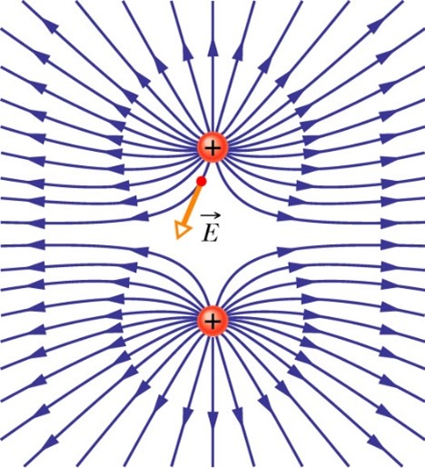{width="80mm"} -->
<!-- ::: -->


```{r echo=FALSE, EfieldLike, out.width='70%', fig.show='hold', fig.align="center", auto_pdf=TRUE, fig.cap="Representation of the electric field of two positive charges (like charges) placed close together."}


```

Note that the field lines are symmetric as they leave the charges. They
do not cross.

## Equipotential surfaces

An equipotential surface is the surface of constant potential. The
electric field is always perpendicular to the equipotential surface as
the heat flow was always perpendicular to the isotherms in the
temperature example. The picture shows an example of the equipotentials
for a point charge. The field lines are in blue and the equipotentials
the dashed black lines. The following website -
<http://www.falstad.com/emstatic/index.html> - allows you to set up
different charge configurations and see the field lines and
equipotentials.

<!-- ::: figurehere -->
<!-- 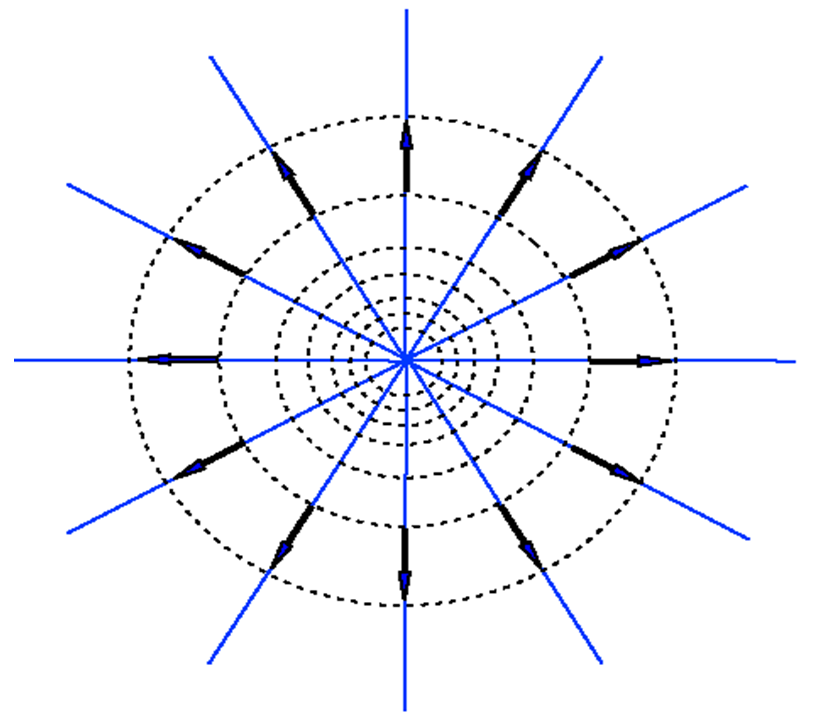{width="80mm"} -->
<!-- ::: -->

<!-- ::: flushleft -->
<!-- ::: -->

```{r echo=FALSE, equipotentials, out.width='70%', fig.show='hold', fig.align="center", auto_pdf=TRUE, fig.cap="Representation of a field radiating outwards from a point (blue lines), showing how the equipotentials (black dotted lines) are always perpendicular to the field lines."}


```


## Summary

-   Fields arise from charges, and not just electric charges.

-   A scalar potential $\Phi$ has an associated vector field
    $-\nabla \Phi$ and the direction of the vector field is
    perpendicular to the equipotentials.

-   We represent fields with lines that show the direction of motion of
    a charge with the density of the field lines indicating the field
    strength.


# Electric potential

*Recommended reading:* Tipler & Mosca Chapters 21,22,23 and some of 24
(please note that we are not covering dielectrics).

## Coulomb's Law

*Recommended reading:* Tipler & Mosca 21-3

Coulomb's Law gives the magnitude and direction of the forces between
charges.

<!-- ::: figurehere -->
<!-- 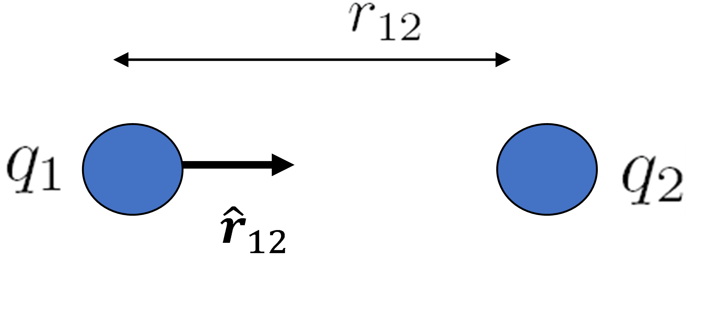{width="80mm"} -->
<!-- ::: -->

<!-- # ```{r echo=FALSE, coulomb1, out.width='70%', fig.show='hold', fig.align="center", auto_pdf=TRUE, fig.cap="Two charges, $q_1$ and $q_2$, separated by a distance of $r_{12}$, with the unit vector $\hat{\r}_{12}$ pointing in the direction from $q_1$ to $q_2$."} -->
<!-- # -->
<!-- #  -->
<!-- # -->
<!-- # ``` -->


$```{r echo=FALSE, coulomb1, out.width='70%', fig.show='hold', fig.align="center", auto_pdf=TRUE, fig.cap="Two charges, q_1 and q_2, separated by a distance of r_12, with the unit vector r_12 pointing in the direction from q_1 to q_2."}


```$


The force on $q_2$ due to $q_1$ is given by:

\begin{equation}
(\#eq:coulombs)
\mathbf{F}_{12}= \frac{1}{4\pi \epsilon_0} \frac{q_1 q_2}{r_{12}^2} \hat{\mathbf{r}}_{12}
\end{equation}

The force on $q_2$ is directed **away from** $q_1$ if $q_1 q_2$ is
positive (i.e. when the charges have the same sign - like charges
repel). If $q_1 q_2$ is negative (charges have different signs), the
force on $q_2$ is directed **towards** $q_1$ (unlike charges attract).

## The electric field

The electric field ($\mathbf{E}$) is defined in terms of the force on a test
charge $q_0$. The force on $q_0$ due to another charge $q$ is

\begin{equation}
(\#eq:forceQ0)
\mathbf{F} = \frac{1}{4\pi \epsilon_0} \frac{q q_0}{r_{12}^2} \hat{\mathbf{r}}_{12}
\end{equation}

The electric field is the force divided by the magnitude of the test
charge -- the field is independent of the charge used to test it.

\begin{equation}
(\#eq:fieldQ)
\mathbf{E} = \frac{\mathbf{F}}{q_0} = \frac{1}{4\pi \epsilon_0} \frac{q}{r_{12}^2} \hat{\mathbf{r}}_{12}
\end{equation}

## Principle of superposition

What if there are several charges?

Have a look at the diagram below:

<!-- ::: figurehere -->
<!-- 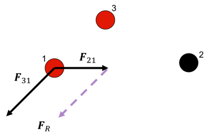{width="80mm"} -->
<!-- ::: -->


$```{r echo=FALSE, superposition, out.width='70%', fig.show='hold', fig.align="center", auto_pdf=TRUE, fig.cap="Three charges, 1, 2 and 3, where charges 1 and 3 are negative and charge 2 is positive. The forces shown are the forces exerted on charge 1 by charge 2 (F_21) and charge 3 (F_31), and the total resultant force on charge 1, F_R."}


```$


The principle of superposition says that the **resultant force** $\mathbf{F}_R$
on charge 1 due to charge 2 and charge 3 is simply the vector sum of the
forces due to the individual charges.

The principle of superposition can be used to calculate the electric
field $\mathbf{E}$ for a group of charges by summing the fields due to all
charges present.

\begin{equation}
(\#eq:superposition)
\mathbf{E} = \mathbf{E}_1 + \mathbf{E}_2 + \mathbf{E}_3 + ... = \sum_i \mathbf{E}_i 
\end{equation}


## Electric dipole field

*Recommended reading:* Tipler & Mosca 21-4

An electric dipole is a combination of a positive and negative charge,
equal in magnitude, a small distance from each other. The field for an
electric dipole can be calculated by summing the field due to the two
charges.

<!-- ::: figurehere -->
<!-- 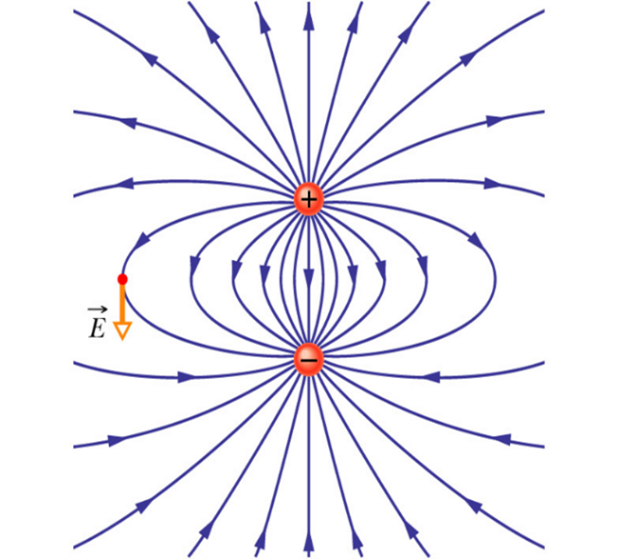{width="80mm"} -->
<!-- ::: -->

```{r echo=FALSE, dipoleField, out.width='70%', fig.show='hold', fig.align="center", auto_pdf=TRUE, fig.cap="The electric field associated with a dipole."}


```

Consider the diagram of the dipole below:

<!-- ::: figurehere -->
<!-- {width="80mm"} -->
<!-- ::: -->

```{r echo=FALSE, dipoleDiagram, out.width='70%', fig.show='hold', fig.align="center", auto_pdf=TRUE, fig.cap="A dipole represented in the x-y plane, where d is the distance between the charges."}

knitr::include_graphics("Figures/dipole_diagram.png")

```


The magnitude of the field at point $P$ is given by

\begin{equation}
(\#eq:fieldatP)
E = \frac{1}{4 \pi \epsilon_0} \frac{qd}{\left( x^2 + \left( \frac{d}{2} \right)^2 \right)^{\frac{3}{2}}}
\end{equation}

and it is in the $-\hat{\mathbf{j}}$ (or $-\hat{\mathbf{y}}$) direction.

### Electric dipole moment

*Definition:* The electric dipole moment, $\mathbf{p}$, is the product of the
charge and the vector displacement from the negative charge to the
positive charge in a dipole.

<!-- ::: figurehere -->
<!-- 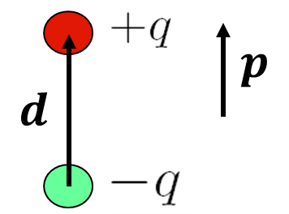{width="80mm"} -->
<!-- ::: -->

```{r echo=FALSE, dipoleMoment, out.width='70%', fig.show='hold', fig.align="center", auto_pdf=TRUE, fig.cap="A diagram of an electric dipole, showing the vector quantities d and p, which are the length of the dipole and the dipole moment respectively."}


```

\begin{equation}
(\#eq:dipoleMoment)
\mathbf{p} = q \mathbf{d}
\end{equation}

The electric field of the dipole (Equation
\@ref(eq:fieldatP)) can therefore be expressed (as a vector) in
terms of the dipole moment, as follows:

\begin{equation}
(\#eq:fieldatPdipole)
\mathbf{E} = \frac{1}{4 \pi \epsilon_0} \frac{\mathbf{p}}{\left( x^2 + \left( \frac{d}{2} \right)^2 \right)^{\frac{3}{2}}}
\end{equation}

In the limit of $x \gg d$ (in other words, when we are at a distance $x$
from the dipole that is much larger than the size of the dipole $d$) the
electric field due to the dipole can be reduced to:

\begin{equation}
(\#eq:EvsP)
\mathbf{E} = \frac{1}{4\pi \epsilon_0} \frac{\mathbf{p}}{x^3}
\end{equation}

::: flushleft
:::

### Dipoles in external electric fields

Consider a dipole in a uniform electric field. The force on each charge
has magnitude $qE$, but since these forces are in opposite directions
there is no net force on the dipole. There is, however a torque about
the centre of the dipole.

<!-- ::: figurehere -->
<!-- ::: center -->
<!-- 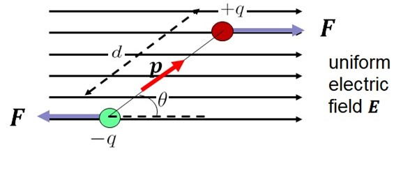{width="80mm"} -->
<!-- ::: -->
<!-- ::: -->

```{r echo=FALSE, dipoleExtE, out.width='70%', fig.show='hold', fig.align="center", auto_pdf=TRUE, fig.cap="Representation of a dipole placed in an external uniform electric field. theta is the angle the dipole takes to the direction of the external electric field and F is the force on each charge of the dipole due to the external field."}


```

The torque about the centre of the dipole is

\begin{equation}
(\#eq:torqueDipole)
\tau = 2 F \frac{d}{2} \sin\theta = q E d \sin\theta = |p|E \sin\theta
\end{equation}

The direction of the torque is perpendicular to the page, so it can be
represented in vector form as $\tau = \mathbf{p} \times \mathbf{E}$.

The torque will cause the dipole to rotate and align itself with the
electric field as shown here:

<!-- ::: figurehere -->
<!-- ::: center -->
<!-- 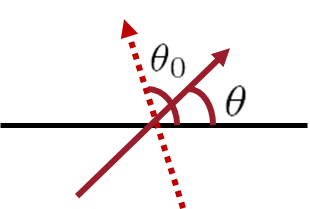{width="80mm"} []{#fig:diAlign -->
<!-- label="fig:diAlign"} -->
<!-- ::: -->
<!-- ::: -->

```{r echo=FALSE, dipoleAlign, out.width='70%', fig.show='hold', fig.align="center", auto_pdf=TRUE, fig.cap=" "}


```


We can use the work done by the field to determine what is the minimum
energy configuration (although it should be fairly obvious). The work
done is the integral of the product of the torque and the angle turned
through:

\begin{equation}
(\#eq:workDone)
\begin{array}{rcll}
W &=& \int_{\theta_0}^{\theta} |\tau| \mathrm{d}\theta \\
&=& \int_{\theta_0}^{\theta} pE \sin\theta \mathrm{d}\theta \\ 
&=& [-pE \cos\theta]_{\theta_0}^{\theta}
\end{array}
\end{equation}

The change in potential energy is $\Delta U = W$, hence:
\begin{equation}
(\#eq:changeEpot)
\Delta U = U(\theta_0) - U(\theta) = pE(\cos⁡\theta_0 - cos\theta)
\end{equation}

The zero of potential energy $U(\theta_0)$ can be chosen to be anywhere,
so we can choose it to correspond to $\theta_0 = 90^{\circ}$ in which
case $U = -pE \cos\theta$. This energy can be expressed in vector form
as $U = - \mathbf{p} \cdot \mathbf{E}$.

Not surprisingly, the energy is a minimum when the dipole is aligned
with the field at which point the torque will be zero.

## Continuous charge distributions

*Recommended reading:* Tipler & Mosca Chapter 22

Charges are discrete i.e. all charges sit on point like particles but if
we have a large number of changes they can be treated as a continuous
charge distribution. Continuous charge distributions can be described by
linear, surface or volume charge densities. To use Coulomb's Law to
calculate the electric field in these cases you may need to integrate
using the charge density.

::: flushleft
:::

## Electric flux & Gauss's Law

Flux has been found to be a concept that's often misunderstood when
discussing electric fields.

::: flushleft
:::

But in the case of the electric field from static charges nothing is
"flowing". You can think of it as the number of field lines passing
through a unit of area. Alternatively consider an analogy of a light
source -- a source of photons.

::: figurehere
::: center
{width="100mm"} []{#fig:lightFlux
label="fig:lightFlux"}
:::
:::

Since photons travel in straight lines, the number of photons passing
through area $A_1$ in unit time is the same as that passing through area
$A_2$, i.e. the flux of photons is the same, $I_1 A_1 = I_2 A_2$ --
where $I_{1,2}$ is photon intensity. The intensity of photons is
proportional to $\frac{1}{A} \propto \frac{1}{r^2}$ so the photon field
depends on $\frac{1}{r^2}$. Replace the light source with a source of
electric field e.g. a point charge. The field starts at the point charge
and spreads out. The amount of field doesn't increase as we move away
from the charge because there is no source of electric field.

::: figurehere
::: center
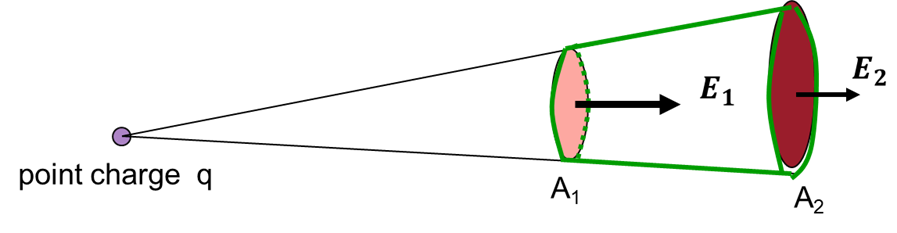{width="100mm"} []{#fig:elecFlux1
label="fig:elecFlux1"}
:::
:::

Consider the field in and out of the volume enclosed between the two
areas (a truncated cone). The total field in and out is the surface
integral of the component of the field normal to the surfaces. On the
curved faces, the normal component of $\mathbf{E}$ is zero. On the spherical
faces, $A_1$ and $A_2$, the field is normal. If flux into the volume is
negative, and flux out is positive $\mathbf{E}$ decreases with $\frac{1}{r^2}$
and the area increases with $r^2$. So the fluxes through the two faces,
$A_1$ and $A_2$, are **equal** and **opposite**.

::: figurehere
::: center
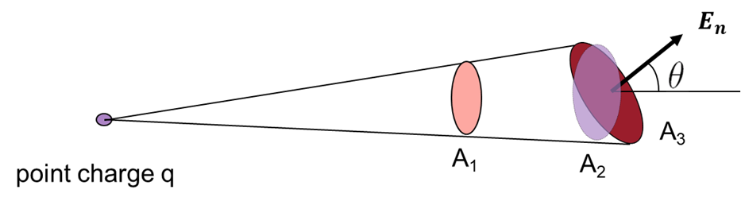{width="115mm"} []{#fig:elecFlux2
label="fig:elecFlux2"}
:::
:::

If a surface is tilted at an angle $\theta$ the field normal to the
surface is $\mathbf{E}_n = \mathbf{E} \cos\theta$. To determine the flux through the
surface we need &#8751; $E  \cos\theta \mathrm{d} A$, where the integral is over
the surface. We can see that this flux is still the same as that through
$A_1$ and $A_2$ because all the flux that impinges on $A_2$ also
impinges on $A_3$.

Consider a spherical surface with a point charge $q$ at the centre:

::: figurehere
::: center
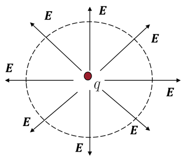{width="80mm"} []{#fig:elecFlux3
label="fig:elecFlux3"}
:::
:::

The net flux is non-zero as $\mathbf{E}$ is pointing outwards over the whole
spherical surface. Because of the symmetry the magnitude of $\mathbf{E}$ is
consistent across the surface and $\mathbf{E}$ is always perpendicular to the
surface.

Total flux of $\mathbf{E}$ is $\Phi_{\mathbf{E}} = E_n \times Area$. Therefore
\begin{equation}
(\#eq:fluxE)
\Phi_E = \frac{q}{4\pi\epsilon_0 r^2} \times 4\pi r^2 = \frac{q}{\epsilon_0} 
\end{equation}

**This result is independent of the radius of the sphere -- in fact, it
is independent of the shape of the surface enclosing the charge.**

## Gauss's Law

(**Note:** In Equations \@ref(eq:GaussnoQ), \@ref(eq:Gauss2) and \@ref(eq:GaussLaw), $\iint_S$ represents the closed surface integral, which is denoted elsewhere in the text as &#8751;.)

We can calculate the electric field from any charge distribution with
Coulomb's Law. Gauss' Law in the integral form which we'll use here can
calculate fields in some highly symmetric cases. Gauss' Law states that
for any **closed surface** $S$:


\begin{equation}
(\#eq:GaussnoQ)
\iint_S{E_n} \mathrm{d} \mathbf{S} = 0
\end{equation}

**if no charge is enclosed** and

\begin{equation}
(\#eq:Gauss2)
\iint_S{E_n} \mathrm{d} \mathbf{S} = \frac{q}{\epsilon_0}
\end{equation}

**if charge $q$ is enclosed**. Or in words: the magnitude of the electric field normal to the surface
integrated over the whole of the surface is equal to the charge enclosed
divided by $\epsilon_0$.

More generally, the integral form of Gauss's Law is
\begin{equation}
(\#eq:GaussLaw) 
\iint_S \mathbf{E} \cdot \mathrm{d} \mathbf{S} =\frac{Q}{\epsilon_0}
\end{equation}

$\mathrm{d} \mathbf{S}$ is a vector normal to the surface with magnitude equal to the
size of an element of area. $\mathbf{E} \cdot \mathrm{d} \mathbf{S}$, which is a scalar product,
extracts the component of the electric field normal to the surface and
multiplies it by the size of an element of the area. $Q$ is the total
charge enclosed within $S$, where $Q = \sum_i q_i$ where the sum runs
over all charges inside $S$ (where $S$ is a closed surface enclosing a
volume $V$).

You can also think in terms of field lines the total number of field
lines leaving the surface is proportional to the total number of charges
inside the surface. If there are positive and negative charges then some
field lines will go in and some out. if the amount of positive and
negative charge is equal these two contributions cancel. Note that this
doesn't mean that the is no field anywhere at the surface but that the
contributions of positive and negative flux over the whole surface
cancel. The integral form of Gauss's Law can be used to find the
electric field for symmetrical systems of charges. We'll look at three
classic examples:

-   Field due to a line of charge, linear charge density $\lambda$ C/m

-   Field due to an infinite plane of charge, surface charge density
    $\sigma$ C/m$^2$

-   Field due to a solid sphere of uniformly distributed charge $Q$

::: flushleft
:::

### Field inside a hollow object

Consider a spherical shell with charge $Q$. By symmetry, the field is
radial in all directions.

Applying Gauss's Law with a spherical Gaussian surface **outside** the
shell, as shown in , gives: 
\begin{equation}
(\#eq:fieldShell)
E_r = \frac{Q}{4\pi\epsilon_0 r^2} 
\end{equation}

i.e. the same as point charge or a solid sphere of charge.

<!-- ::: figurehere -->
<!-- ::: center -->
<!-- 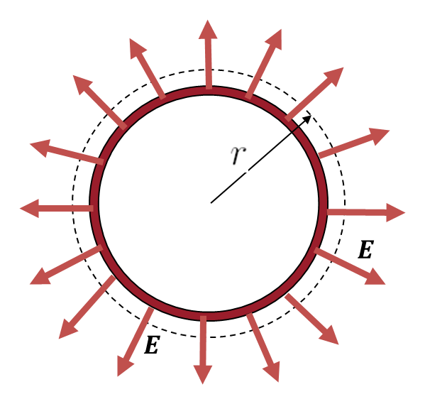{width="80mm"} -->
<!-- ::: -->
<!-- ::: -->

```{r echo=FALSE, GaussOutsideShell, out.width='70%', fig.show='hold', fig.align="center", auto_pdf=TRUE, fig.cap="A spherical shell (dark red area) of charge Q and radius r producing an electric field E (light red arrows). The dotted line outside the shell can be selected as a Gaussian surface. "}


```

Applying Gauss's Law with a spherical Gaussian surface inside the shell
gives $E_r = 0$ because there is no charge inside the surface.

**There is no electric field inside a uniform shell of charge.**

In a conductor, charges are free to move and as like charges repel
excess charge will move to the outside surface of an isolated conductor.

<!-- ::: figurehere -->
<!-- ::: center -->
<!-- 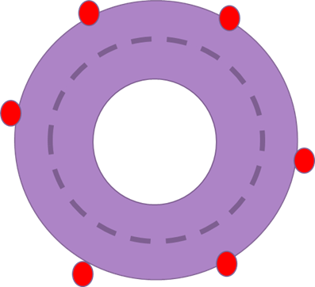{width="80mm"} -->
<!-- ::: -->
<!-- ::: -->

```{r echo=FALSE, GaussInsideShell, out.width='70%', fig.show='hold', fig.align="center", auto_pdf=TRUE, fig.cap="The cross-section of a conductor, where the red circles represent the excess charge which will move to the outside surface of the conductor. The dotted line can be selected as a Gaussian surface to show that the field inside the conductor is zero (because there is no (net) charge enclosed in this Gaussian surface)."}


```

Consider a Gaussian surface just inside a conductor as shown in the diagram above. The
electric field is zero everywhere inside the conductor -- because all
the charges are on the outside. The flux through the Gaussian surface
must therefore be zero.

This applies if there is a cavity inside the conductor and so inside any
cavity in a conductor, the electric field is zero. This principle is
used to build Faraday Cages to shield sensitive electronics.

The field at the surface of a conductor is always perpendicular to the
surface. If this wasn't the case, there would be a component of the
field tangential to the surface. The charges in the conductor would move
across the surface under the influence of the tangential component of
the field until that component was zero. Therefore the field is always
perpendicular to the surface.

## Electric potential

The electric potential due to a positive charge is positive. The
electric potential due to a negative charge is negative. The potential
difference between two points, $a$ and $b$, is

\begin{equation}
(\#eq:DeltaV)
\Delta V = V_b - V_a =\frac{(U_b - U_a)}{q_0}   
\end{equation}

The electric (or electrostatic) potential, often just called potential,
is defined as the potential energy per unit (test) charge.

Consider bringing an infinitesimal test charge ($q_0$) from infinity
into a region containing a system of charges. If $U$ is the final
potential energy of the charge the electric potential is given by
$V = U/q_0$.

The change in potential energy in going from point $a$ to point $b$ is
given by the integral along the path from $a$ to $b$ of the work done on
the charge:

\begin{equation}
(\#eq:DeltaU)
\Delta U = - W_{ab} = -\int_a^b \mathbf{F} \cdot \mathrm{d}\mathrm{l} = -q_0 \int_a^b \mathbf{E} \cdot \mathrm{d}\mathrm{l}
\end{equation}

We know that 
\begin{equation}
(\#eq:DeltaU2)
\frac{\Delta U}{q_0} = V_b - V_a
\end{equation}

hence

\begin{equation}
(\#eq:DeltaVab)
\Delta V_{ab} = -\int_a^b \mathbf{E} \cdot \mathrm{d}\mathrm{l}
\end{equation}

So the change in electrical potential is the line integral of the
electric field along the path from $a$ to $b$. We can choose the
reference point of the potential to be where we like but normally select
infinity. So

\begin{equation}
(\#eq:Vb)
V_b = -\int_\infty^b \mathbf{E} \cdot \mathrm{d}\mathrm{l}
\end{equation}

The potential at a distance $r$ from a point charge is

\begin{equation}
(\#eq:V-r)
\begin{array}{rcll}
V(r) &=& -\int_\infty^r \frac{1}{4\pi\epsilon_0} \frac{q}{r^2} \mathrm{d} r \\
     &=& \frac{q}{4\pi\epsilon_0} \left[ \frac{1}{r} - \frac{1}{\infty} \right] \\
     &=& \frac{q}{4\pi\epsilon_0} \frac{1}{r}
\end{array}
\end{equation}

**Note:** The dependence of the potential for a point charge on distance
is $\frac{1}{r}$ and the force depends on $\frac{1}{r^2}$ because the
electric field is the gradient of the potential.


# Work and energy in electrostatics

## The magnetic field

*Recommended reading:* Tipler & Mosca 26

In electrostatics, we viewed electric charges as interacting via the
electric field to avoid action at a distance. The field surrounds any
charge and when a second charge is brought near to the first it
interacts with the field that is already present.

Can we think of "magnetic charges\" interacting via the magnetic field,
$\mathbf{B}$? **No.** This is because magnetic charges have not been found to
exist - there is no evidence for single North or South poles. Searches
have been made for magnetic monopoles, but without any success, although
their existence has not been entirely ruled out. (This is way beyond our
syllabus but if you are interested you could try looking at
<https://royalsocietypublishing.org/doi/10.1098/rsta.2018.0328>.)

The magnetic field is produced by *moving* electric charges (i.e.
electric currents). As with the electric field, the magnetic field can
be represented using field lines and the density of field lines
represents the strength of the field and the direction is that in which
a north pole would move.

The magnetic field $\mathbf{B}$ is measured in the SI unit of Tesla or in Gauss:
1 Tesla = $10^4$ Gauss =
$\frac{\mathrm{Ns}}{\mathrm{Cm}} = \frac{\mathrm{N}}{\mathrm{Am}}$.

There are some important differences between the behaviour of charges in
electric and magnetic fields. In electric fields, the force on a charge
is parallel to the field lines -- a positive charge moves along the
field lines in the direction indicated. In magnetic fields, the force on
a *moving* charge is perpendicular to the field lines.

<!-- ::: figurehere -->
<!-- {width="120mm"} -->
<!-- ::: -->

```{r echo=FALSE, MagFields, out.width='70%', fig.show='hold', fig.align="center", auto_pdf=TRUE, fig.cap="Left: The magnetic field produced by a bar magnet. Right: Section of a wire (yellow) carrying current I and the magnetic field B that it produces."}

knitr::include_graphics("Figures/MagFields.png")

```

Magnetic field lines always form closed loops whereas electric field
lines begin and end on charges. This means that a version of Gauss' Law
for magnetism states $\Phi_B =$ &#8751; $\mathbf{B} \cdot \mathrm{d} \mathbf{S} = 0$ (see Tipler &
Mosca, 27-3). As field lines are closed all field lines entering a
closed surface must leave it as well. So net magnetic flux through the
surface is zero.

The direction of the magnetic field direction due to an electric current
is given by the right-hand rule. If you point the thumb of your right
hand in the direction of the current and then curl the fingers the field
is in the direction of the curl of your fingers.

## Forces from Magnetic Fields

*Recommended reading:* Tipler & Mosca 26-2

The Lorentz force describes the force felt by a moving charge in a
combination of electric and magnetic fields.

\begin{equation}
(\#eq:qvCrossB)
\mathbf{F} = q(\mathbf{E} + \mathbf{v} \times \mathbf{B})
\end{equation}

The cross product tells us that force due to the magnetic field $\mathbf{B}$ is
perpendicular to the magnetic field and the velocity of a charged
particle ($\mathbf{v}$) and therefore when the velocity and magnetic field are
parallel (or antiparallel) to each other, the force on the charged
particle due to the magnetic field is zero. Since the magnetic force, is
always perpendicular to the velocity vector of the particle it cannot do
any work on the charge and therefore cannot change the energy and speed
of the particle.

<!-- ::: figurehere -->
<!-- {width="80mm"} -->
<!-- ::: -->

```{r echo=FALSE, bubbleChamber, out.width='70%', fig.show='hold', fig.align="center", auto_pdf=TRUE, fig.cap="Enhanced image of the traces in a bubble chamber, which shows the paths of charged particles."}


```

The artistically enhanced image above was produced by the Big European
Bubble Chamber (BEBC), which started up at CERN in 1973. Charged
particles passing through a chamber filled with hydrogen-neon liquid
leave bubbles along their paths (Image: BEBC). You can see the spiral
paths of the charged particles as they move in circles under the
influence of the magnetic field but lose energy through collisions with
the Hydrogen-neon atoms.

### JJ Thomson's measurement of $e/m$

As seen in the previous exercise, the electric and magnetic forces on a
charged particle are equal if $E = vB$, i.e. when the speed of the
particle is given by $E/B$. This condition doesn't depend on the mass or
the charge of the object. JJ Thomson used this to make a measurement of
$e/m$ for the "cathode rays\" demonstrating that these rays consisted of
particles. The principle of the experiment is to apply crossed electric
and magnetic fields, that is electric and magnetic fields at right
angles to each other. First the deflection in the $E$ field only is
measured. In this case the force depends on charge and the deflection on
mass and $v$. A magnetic field is that applied to give an overall
deflection of zero. At this point the forces due to $\mathbf{E}$ and $\mathbf{B}$ are
balanced and the velocity of the particle is therefore measured and can
be used with the 1st result, for the $E$ field only, to calculate the
charge/mass ratio.

### Circulating charges


# Magnetic field of currents
this is the new section stuff 

# Magnetic vector potential

# Gauss's Law

# Ampere's Law and solenoids

# Electromagnetic induction 

# Maxwell's equations in free space

# Magnetisation and polarisation

# Maxwell's equations in matter

# Capacitors and inductors

# Circuits

# Impedance 
